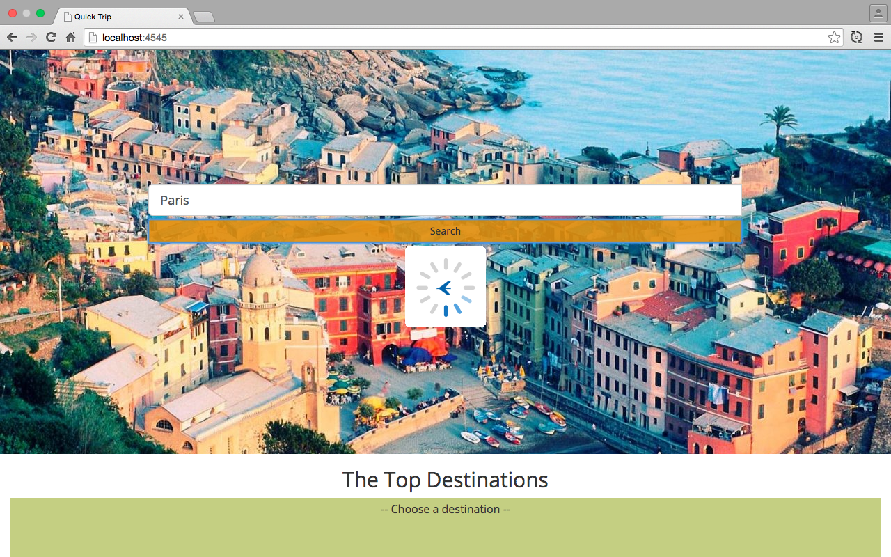
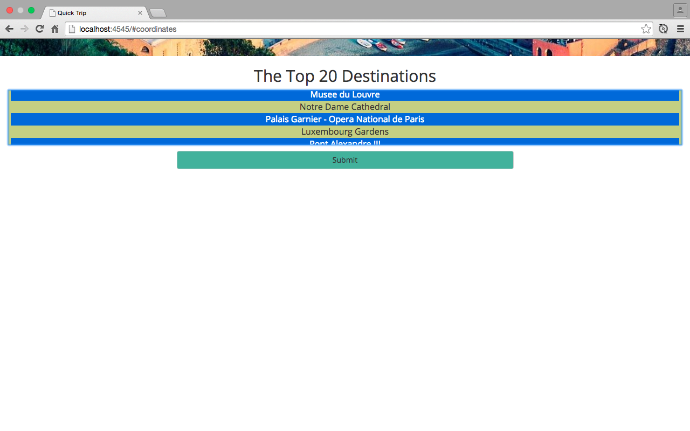
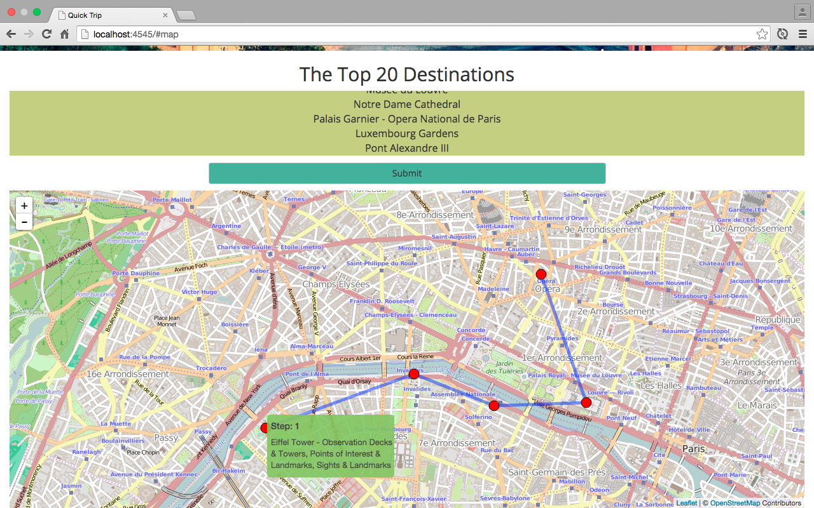

# Quick Trip
> Quick Trip is an applet that gives a general overview of the top 20~30 destinations of a given input.
> Users can choose as many destinations as they can visit within a day and the results are plotted onto a leaflet map.
> The map displays how close/far each point is from each other, giving the user a better idea of how to plan their trip.

## Getting Started

In your terminal:

```
git clone https://github.com/nyjy85/quick_trip.git
npm install
gulp build
npm start
```

## Usage
1. Type in any destination you want to go.

2. Choose as many places you can go to in a day.

3. Shortest path is visualized onto a leaflet map.

